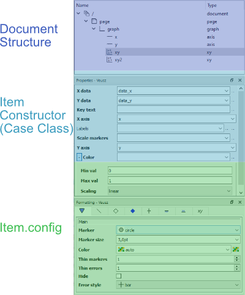

# ScalaVeusz
[](https://travis-ci.org/staeff777/scalaveusz)[](https://maven-badges.herokuapp.com/maven-central/de.dreambeam/scalaveusz_2.12)

Create [Veusz](https://veusz.github.io/) charts in Scala.
The combination of this API and Vuesz allows to 
- quickly create various types of plots in Scala, 
- open them in the Veusz editor to try out different layouts and styles and then to
- adjust the settings in the source code according to the UI.

It is useful for the creation of static scientific plots, if render time is not a key requiement (due to the execution of an external program). 

- [First Steps](#first-steps)
- [How to use the API](#how-to-use-the-api)
  - [Quick Access to Veusz Items](#quick-access-to-veusz-items)
  - [Document Structure](#document-structure)
  - [Changing Item Settings and Style](#changing-item-settings-and-style)
- [Dealing with Date and Time](#dealing-with-datetime) 

## First Steps
1. Install [Veusz](https://veusz.github.io/download/)
   
   To be able to export plots as Image or PDF, the directory of the Veusz binare needs to be in the [path variable](https://en.wikipedia.org/wiki/PATH_(variable)). 

2. Include the dependency requirements into the build.sbt:
    ```scala
    libraryDependencies += "de.dreambeam" %% "scalaveusz" % "0.4.8" // version according to Maven Central Badge in the top of this page
    ```
    **Scala 2.12** and **2.13** are currently supported.
    
3. Create an Example:
    
    ```scala
    import de.dreambeam.veusz._
    object Veusztest extends App {
    
      // XY Plots use 2 one-dimensional datasets
      val xData = (1.0 to 10.0 by 0.5).toVector
      val yLinear = xData.map (_ * 1.25)
      val ySin = xData.map (2 * Math.sin(_) + 5)
    
      // create a linear XY Point Plot with Lines
      val xyLinearPlot = GraphItems.XY(xData, yLinear)
      xyLinearPlot.config.plotLine.color = "darkblue"
      xyLinearPlot.config.markerFill.color = "blue"
    
      // create a sinus XY Point Plot with Lines
      val xySinusPlot = GraphItems.XY(xData, ySin)
      xySinusPlot.config.plotLine.color = "darkred"
      xySinusPlot.config.markerFill.color = "red"
    
      // put both XY Plots into a Graph
      val graph = PageItems.Graph(xyLinearPlot, xySinusPlot)
    
      graph.axis(0).label = "X Axis" //Axis can also be defined in the Graph constructor
      graph.axis(1).label = "Y Axis" //More than just two axis is possible
    
      graph.openInVeusz("newTest")
    }
    ```

4. This will result in the following Veusz project:


For further examples see [scalaveusz-examples](https://github.com/staeff777/scalaveusz-examples)

# How to use the API
## Quick Access to Veusz-Items
The Veusz API should be accassible through a single import of `de.dreambeam.veusz._` . Items can be accessed using the `V` shortcut object and the autocomplete features of your prefered IDE.  


It is possible to either browse the document structure to find a prefered Item


.. or to access the Items directly


## Document Structure
The following figure shows the possible structure of a Veusz document.


### Builing a document tree
Per definition, each **chart** is in a **graph** which is in a **page** (or a **grid within a page**), which is in a **document**. 
```scala
val xy = V.GraphItems.XY(xData, yLinear)
val graph = V.PageItems.Graph(xy)  // takes multiples Graphs
val page = V.DocumentItems.Page(graph) // takes a single graph or a grid
val document = V.Document(page) // takes multiple pages
```

### Autowrapping

To reduce unnecessary boilerplate code, Scalaveusz offers autowrapping. For example, If you put a **chart** into a **document** the plot would then automatically be wrapped with each required parent (**graph** and **page**). 
```scala
val xy = V.GraphItems.XY(xData, yLinear)
val xy2 = V.GraphItems.XY(xData, ySin)
val document = V.Document(xy, xy2) // places each item into a separate page
```
## Changing Item Settings and Style
The following image shows the mapping between the Veusz UI and the API's data objects:



XY Item is created using two Vectors, Axis 'x' and 'y' are used default
```scala 
val xyLinearPlot = GraphItems.XY(xData, yLinear)
```
All properties are mutable. Although this is not a good functional style, it allows simple and quick changes.
We decided for ease of use over convention since it is still your option to treat each object as if it was immutable.
However, the conversion from Vector to the Numerical type must be done manually. (TODO Explain Datatypes)
```scala 
xyLinearPlot.colorMarkers = Numerical(ySin)
```
The Item Configuration can be accessed over the config property. 
This contains a subconfiguration for each Veusz Formatting Tab.

```scala
xyLinearPlot.config.main.markerSize = 2 pt() // pt(), cm(), mm(), in() or percent()
xyLinearPlot.config.plotLine.color = "#ff007f"
xyLinearPlot.config.markerFill.color = "darkred"
```
The colorMarker Configuration is also integrated into the config object.
```scala
xyLinearPlot.config.colorConfig.min = 2.5
xyLinearPlot.config.colorConfig.max = 7.5
```

# Dealing with DateTime

There are several options:

1. **Using java.time.LocalDate**

    ```scala
    val dates: Vector[LocalDate] = ???
    val datesFormatted = DateTimeConstructor.fromLocalDate(dates)
    ```

2. **Using java.time.LocalDateTime**

    ```scala
    val dates: Vector[LocalDateTime] = ???
    val datesFormatted = DateTimeConstructor.fromLocalDateTime(dates)
    ```

3. **Using String**

    ```scala
    val dates = Vector("1/22/2020", "1/23/2020", "1/24/2020")
    val datesFormatted = DateTimeConstructor.fromString(dates)("M/dd/yyyy")
    ```

### Giving an offset to the dates

```scala
// Increase all dates by 30 days
val datesFormatted = DateTimeConstructor.fromString(dates)("M/dd/yyyy")(Map("dd"->30))
```
