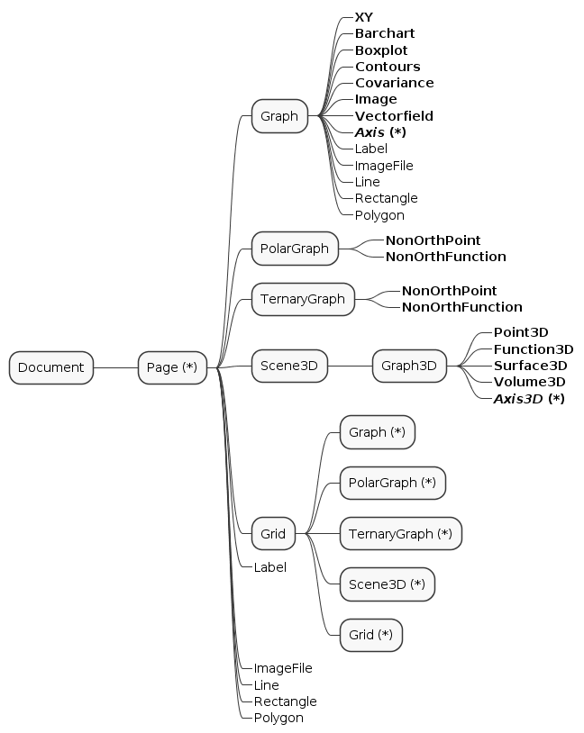

# ScalaVeusz
[](https://travis-ci.org/staeff777/scalaveusz)[](https://maven-badges.herokuapp.com/maven-central/de.dreambeam/scalaveusz_2.12)

Create [Veusz](https://veusz.github.io/) charts in Scala.
The combination of this API and Vuesz allows to 
- quickly create various types of plots in Scala, 
- open them in the Veusz Editor to try out different layout and styles and then to
- adjust the settings in code according to the UI.

It is useful for the creation of static scientific plots, if render time is not a key requiement (due to the execution of an external program). 

## First Steps
1. Install [Veusz](https://veusz.github.io/download/)
   
   To be able to export plots as Image or PDF, the directory of the Veusz binare needs to be in the [path variable](https://en.wikipedia.org/wiki/PATH_(variable)). 

2. Include the dependency requirements into the build.sbt:
    ```scala
    libraryDependencies += "de.dreambeam" %% "scalaveusz" % "0.4.0" // version according to Maven Central Badge in the top of this page
    ```
    **Scala 2.12** and **2.13** are currently supported.
    
3. Create an Example:
    
    ```scala
    import de.dreambeam.veusz._
    object Veusztest extends App {
    
      // XY Plots use 2 one-dimensional datasets
      val xData = (1.0 to 10.0 by 0.5).toVector
      val yLinear = xData.map (_ * 1.25)
      val ySin = xData.map (2 * Math.sin(_) + 5)
    
      // create a linear XY Point Plot with Lines
      val xyLinearPlot = GraphItems.XY(xData, yLinear)
      xyLinearPlot.config.plotLine.color = "darkblue"
      xyLinearPlot.config.markerFill.color = "blue"
    
      // create a sinus XY Point Plot with Lines
      val xySinusPlot = GraphItems.XY(xData, ySin)
      xySinusPlot.config.plotLine.color = "darkred"
      xySinusPlot.config.markerFill.color = "red"
    
      // put both XY Plots into a Graph
      val graph = PageItems.Graph(xyLinearPlot, xySinusPlot)
    
      graph.axis(0).label = "X Axis" //Axis can also be defined in the Graph constructor
      graph.axis(1).label = "Y Axis" //More than just two axis is possible
    
      graph.openInVeusz("newTest")
    }
    ```

4. This will result in the following Veusz project:


For further examples see [scalaveusz-examples](https://github.com/staeff777/scalaveusz-examples)

# Structure
The following figure shows the possible structure of a Vuesz document.



# Dealing with DateTime

There are several options:

1. **Using java.time.LocalDate**

    ```scala
    val dates: Vector[LocalDate] = ???
    val datesFormatted = DateTimeConstructor.fromLocalDate(dates)
    ```

2. **Using java.time.LocalDateTime**

    ```scala
    val dates: Vector[LocalDateTime] = ???
    val datesFormatted = DateTimeConstructor.fromLocalDateTime(dates)
    ```

3. **Using String**

    ```scala
    val dates = Vector("1/22/2020", "1/23/2020", "1/24/2020")
    val datesFormatted = DateTimeConstructor.fromString(dates)("M/dd/yyyy")
    ```

### Giving an offset to the dates

```scala
// Increase all dates by 30 days
val datesFormatted = DateTimeConstructor.fromString(dates)("M/dd/yyyy")(Map("dd"->30))
```
