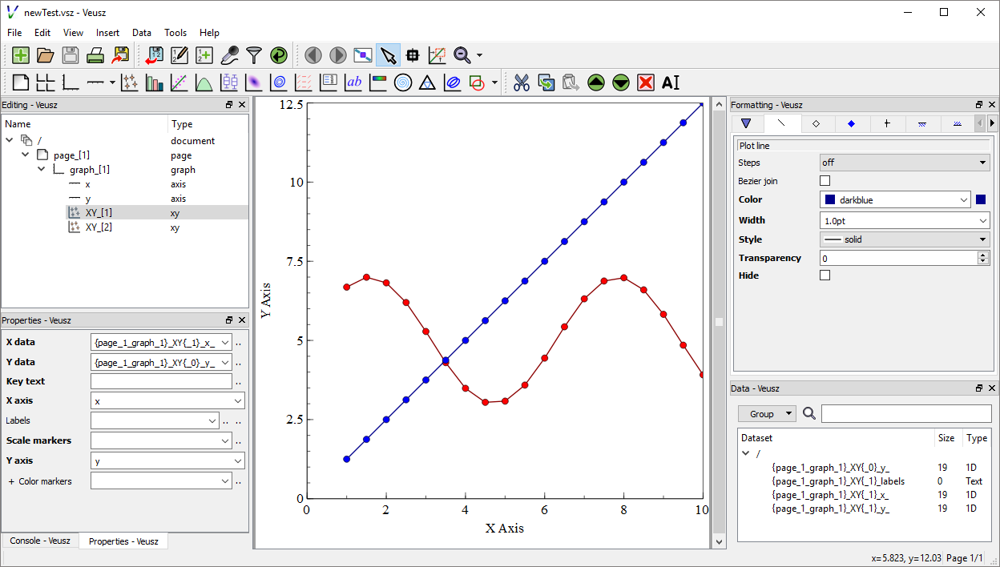

# VeuszLib

[](https://travis-ci.org/staeff777/scalaveusz)[](https://maven-badges.herokuapp.com/maven-central/de.dreambeam/scalaveusz_2.12) 

Create [Veusz](https://veusz.github.io/) charts in Scala.

The Api is currently work in progress.

## First Steps

Include the dependency requirements into the build.sbt:
```scala
libraryDependencies += "de.dreambeam" %% "scalaveusz" % "0.1.3" // version according to Maven Central Badge in the top of this page
```

Start with follwing example chart:
```scala
import de.dreambeam.veusz.VeuszOutput._
import de.dreambeam.veusz.model._

object RendererTest extends App {

  // XY Plots use 2 one-dimensional datasets
  val xData = (1.0 to 10.0 by 0.5).toVector
  val yLinear = xData.map (_ * 1.25)
  val ySin = xData.map (2 * Math.sin(_) + 5)

  // create a linear XY Point Plot with Lines
  val xyDataLinear = XYData(XYDataEntry(xData), XYDataEntry(yLinear))
  val xyLinearPlot = GraphItems.XY(xyDataLinear)
  xyLinearPlot.config.lineStyle.color = "blue"
  xyLinearPlot.config.markerFill.color = "blue"

  // create a sinus XY Point Plot with Lines
  val xyDataSinus = XYData(XYDataEntry(xData), XYDataEntry(ySin))
  val xySinusPlot = GraphItems.XY(xyDataSinus)
  xySinusPlot.config.lineStyle.color = "red"
  xySinusPlot.config.markerFill.color = "red"

  // put both XY Plots into a Graph
  val graph = Graph(xyLinearPlot, xySinusPlot)

  graph.axis(0).label = "X Axis" //Axis can also be defined in the Graph constructor
  graph.axis(1).label = "Y Axis" //More than just two axis is possible

  val p = Page(graph) // a Page can contain one Graph or a Grid with multiple Graphs 
  
  val document = Document(p) // a Document can contain multiple Pages

  //document will be saved in a "veusz-Directory" and then opened by the operating system
  //the show command comes from VeuszOutput
  document.show("newTest")
}
```
This will result in following Veusz project:

